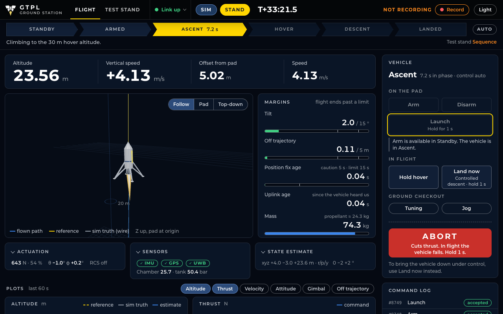
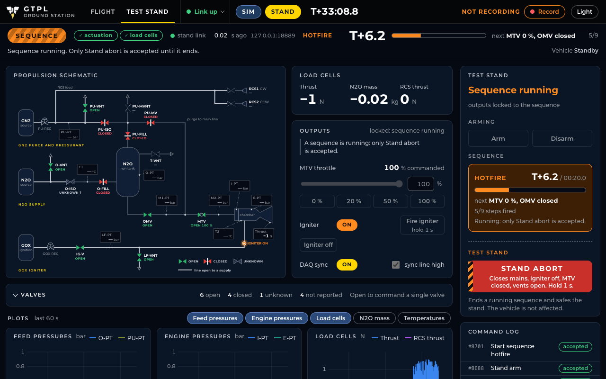

# ground-system

Ground systems for GT Propulsive Landers: the test stand controller and the ground-station GUI.
One UI shows what the vehicle or the stand is doing, live, and commands it. Works the same against
the simulator, the hotfire stand, a bench vehicle, or a flight.

- **Flight view**: 3D position and attitude against the guidance trajectory, flight phase,
  TVC gimbal / thrust / RCS actuation, navigation and sensor health, and live margins against the
  flight-termination limits.
- **Test stand view**: P&ID schematic with live load cells, valve states, MTV throttle and igniter;
  arm the stand, drive valves and the MTV, fire the igniter, run the timed hotfire / cold flow /
  RCS / igniter-check sequences, and abort to a safe state.
- **Commands**: arm, disarm, launch, abort, hold hover / land now, live MPC and flight-parameter
  tuning, and a Standby-only jog mode for actuator checkout. Every command is acked.
- **Recording**: press Record before a test; everything from then until Stop lands as CSVs in
  `logs/` (gitignored), replayable through the same UI.

```
 vehicle (Lander)      ─┐
 sim (rust_rocket_sim) ─┼─ UDP ─►  gs-bridge  ─ WebSocket ─►  browser(s)
 test stand (gs-stand) ─┘
   └─ Jetson: USB serial to the actuation + load-cell Arduinos, PWM to the MTV servos
```





How the pieces fit, the link rules and the WebSocket API are in [docs/DESIGN.md](docs/DESIGN.md).

## Layout

| Path | What |
|---|---|
| `crates/gs-protocol` | Wire types and encoding, shared with the flight software and the sim |
| `crates/gs-bridge` | `gs-bridge` (UDP ⇄ WebSocket server, recorder, replay) and `gs-mock` (fake vehicle, or fake stand with `--stand`) |
| `crates/gs-stand` | Test-stand adapter for the Jetson: Arduino serial protocol, MTV servos, timed sequences. [README](crates/gs-stand/README.md) |
| `stand/` | `config.toml` (ports, pins, MTV geometry, load-cell scaling, safing list) and `sequences/*.toml` |
| `web/` | Browser UI (Vite, React, TypeScript) |
| `jetson stuff/` | The original Arduino sketch (`test_stand.ino`, still the firmware on the stand) and the Python procedures that `gs-stand` replaces. Reference only. |

## Run it

Needs Rust (stable) and Node 20+.

```sh
# once
cd web && npm install && npm run build && cd ..

# fake vehicle and fake test stand, for trying the UI with nothing else set up
cargo run --release --bin gs-mock                    # vehicle on UDP 8888
cargo run --release --bin gs-mock -- --stand --port 8889

# the bridge (serves the UI on http://localhost:8080)
cargo run --release --bin gs-bridge -- --stand 127.0.0.1:8889
```

Open <http://localhost:8080>. Flight tab: Arm, then Launch. Test stand tab: Arm the stand, then
drive valves or start a sequence. Press Record first if you want the data.

### At the test stand

On the Jetson (Arduinos on USB, MTV servos on the PWM pins, see `stand/config.toml`):

```sh
cargo run --release --bin gs-stand           # UDP 8889
```

On the operator laptop:

```sh
cargo run --release --bin gs-bridge -- --stand <jetson-ip>:8889
```

Sequences are TOML files in `stand/sequences/`; `gs-stand --fake-arduino` runs everything against
an in-process fake of both boards for practising or checking a new sequence without hardware.

### Against the simulator

The sim runs the real `Lander` flight state machine, so this is the closest thing to flying.

```sh
# in a checkout of Propulsive-Landers-GT/simulations
cd RocketSimulation/rust_rocket_sim
cargo run --release -- --ground-station      # add --loop to return to Standby after each flight
```

`Lander` and the sim link against OpenBLAS: `brew install openblas` on macOS,
`apt install libopenblas-dev` on Linux.

### Against the vehicle

Run `Lander` on the flight computer, then point the bridge at it:

```sh
cargo run --release --bin gs-bridge -- --vehicle <flight-computer-ip>:8888
```

The vehicle sends telemetry back to whichever bridge it last heard from; nothing to configure on board.

### UI development

```sh
cd web && npm run dev     # proxies /ws to a bridge on :8080
```

### Replay

```sh
cargo run --release --bin gs-bridge -- --replay logs/<utc>-<name>/
```

## Safety notes

- **Stand abort** ends any sequence, turns the igniter off, closes the mains, closes the MTV and opens
  the vents (the safing list in `stand/config.toml`). The old `exit` only closed OFILL and IGV.
- **Restarting `gs-stand` (or plugging USB back in) resets the Arduino, whose `setup()` closes both
  vents.** That is in the Arduino sketch, not in this software; it is flagged as a Warning event on
  every connect. The sketch also has no watchdog, so if USB drops mid-burn outputs hold their last
  state. Both need firmware changes.
- **Flight abort cuts thrust.** In flight the vehicle falls. "Land now" is the controlled option. The UI
  keeps them apart and both need a press-and-hold.
- The vehicle is the authority on every interlock; the UI only mirrors them.
- Loss of link triggers nothing on the vehicle yet. It reports link age; the policy is a team decision.
- The link has no authentication. Run it on an isolated network.
